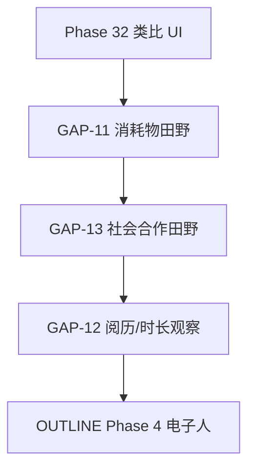

# 世界完备性规划 · Phase 32

> 回应观察者提出的四类缺口：**消耗物、阅历/年龄、社会合作、双版本呈现**  
> 原则：世界规则仍走观察路线；**类比版仅为 UI 辅助，不写入 L2 辞典**。

---

## 一、现状：已能观察 vs 尚未说清

### 1. 电子狗「消耗什么」生存？

| 已观察（CODEX·基底代谢） | 尚未确立 |
|--------------------------|----------|
| 每 tick 从基底场 **e0–e7** 某通道 **摄取**（`[DRW]`） | 这不等于地球上哪一种物质（食物/电/数据） |
| 通道值 **< 0.12** 记 `[LOW]` 匮乏 | LOW **≠** 饥饿/缺水等预制需求名 |
| 摄取转入寄存器；膜域限制跨通道摄取（`[MBR]`） | 无「库存」「消化」「排泄」等第二套循环 |
| 持续匮乏或高压可致 `[END]` | 无命名后的「生存资源类型表」 |

**田野结论（当前）**：电子狗消耗的是**数字基底场上的通道态**，不是已命名的地球资源。  
**开放缺口** → [GAPS.md](GAPS.md) **GAP-11**

### 2. 阅历 / 年龄 / 个体差异

| 已有 | 没有 |
|------|------|
| `generation` 谱系代次（LINEAGE 子代 +1） | 地球式「年龄」「成年」 |
| `tickCount` 个体已存活拍数 | 结构化「阅历」「记忆影响行为」（记忆迹不反馈行为） |
| `bornAtTick` 诞生时刻 | 因经历而变的性格维度 |
| DNA + 身份证 + 寄存器漂移 | 可读的「人生阶段」标签 |

**田野结论**：有**谱系代次**与**存活时长**，无**阅历系统**。  
**开放缺口** → **GAP-12**

### 3. 合作与社会行为

| 已有（Phase 16–17） | 未摸透 |
|---------------------|--------|
| 社会位 S0–S3 持久分配 | 合作是否提高存活（因果） |
| `[SOC]` 迹：TX / RX / TGT / contest | 分工、联盟、互惠 |
| 同节点争夺 `contest` 可计数 | 社会位是否预测行为差异 |
| 四体信号链、RX 影响内在 | 「社会角色」名称（禁止预制） |

**田野结论**：有**社会迹可记录**，无**合作定律**。  
**开放缺口** → **GAP-13**  
**建议田野**：四体/五体长时运行 + 按社会位分层统计 END/LINEAGE/DRW（`field:phase32` 候选脚本）

### 4. 双版本呈现 ✅ Phase 32 交付

| 模式 | 说明 |
|------|------|
| **原版** | 现行：`DRW`、`LOW`、`e0`、社会位 S0… |
| **类比版** | 地球常见词辅助：「从环境摄取」「环境不足」「环境场通道」… |

切换位置：观察台工具栏 **「原版 | 类比」**。  
**不改变世界规则**，不写入 CODEX。

实现：`src/ui/analogy.js`

---

## 二、推荐推进顺序

1. **Phase 32**（本次）：类比呈现 + GAP 登记 + 本文档  
2. **Phase 33 候选**：`field:phase32` 社会合作专项田野（3000 tick × 多种子）  
3. **Phase 34 候选**：若 OBS 支持，扩展代谢可观察层（仍不预制「食物」名）  
4. **电子人**：在以上观察饱和后再立项

---

## 三、类比版映射原则

- 只翻译**已在 CODEX/日志中出现的标签**  
- 禁止把未观察现象映射成「情感」「饥饿」等  
- 界面标注：**类比呈现 · 非辞典**

完整对照见 `src/ui/analogy.js` 中 `LABELS`。

---

*观察者确认后，新 OBS 驱动 GAP-11/12/13 的引擎扩展。*
